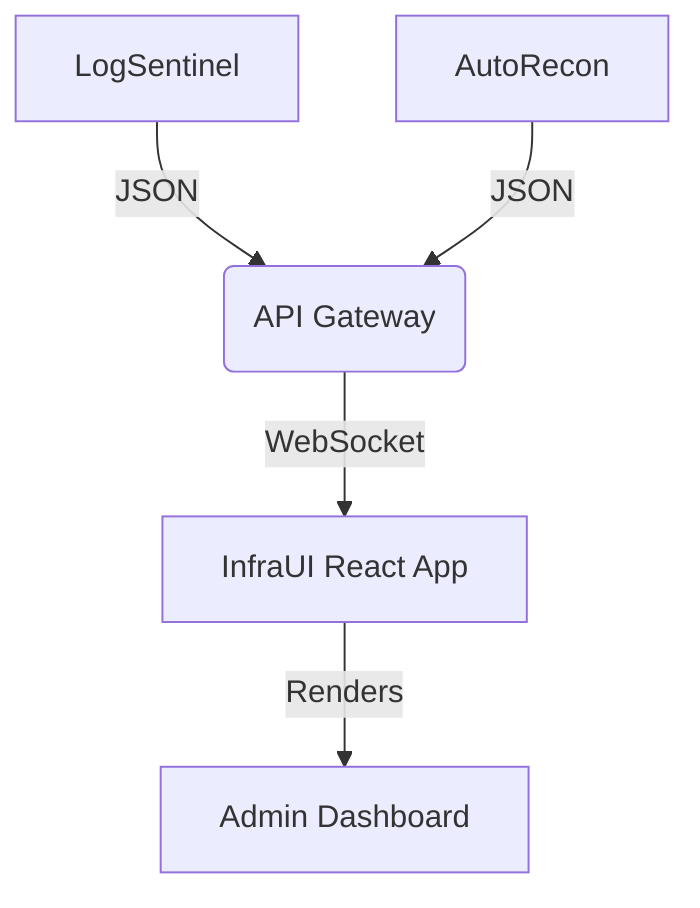

# 📊 InfraUI

**Live Infrastructure Monitoring Dashboard**


## 🚀 Overview

InfraUI is a React-based frontend that visualizes the security metrics collected by **LogSentinel** and **AutoRecon**. It provides a "single pane of glass" for monitoring server health, active threats, and uptime stats.

### 🛡️ Features

- ** Live Metrics:** Real-time updates for CPU/RAM and Network IO.
- ** Threat Feed:** Displays recent IPs blocked by LogSentinel.
- ** Visualizations:** Dynamic traffic charts and alert heatmaps.
- ** API Integration:** Consumes JSON payloads from backend monitoring agents.

## 📦 Run Locally

```bash
npm install
npm run dev
```

Since this is a frontend for a secure internal system, the public version uses **mock data generators** to demonstrate functionality without exposing sensitive infrastructure details.

## 🏗️ Architecture



## 📄 License

[MIT](https://choosealicense.com/licenses/mit/)
