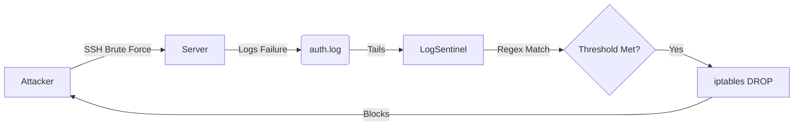

# 📋 LogSentinel

**Real-Time Intrusion Detection System (IDS)**


## 🚀 Overview

LogSentinel is a lightweight IDS that monitors server authentication logs in real-time. It detects brute-force attack patterns and automatically responds by updating firewall rules to block malicious IPs.

### 🛡️ Key Features

- ** Real-Time Monitoring:** Tails `/var/log/auth.log` or equivalent system journals.
- ** Regex Parsing:** Identifies failed login attempts vs. valid sessions.
- ** Automated Response:** Triggers `iptables` rules to drop traffic from offending IPs.
- ** Configurable Thresholds:** Set custom limits for retry attempts and temporary ban durations.

## 📦 Usage

### 1. Requirements
- Python 3.8+
- Root privileges (for modifying iptables)

### 2. Run Sentinel
```bash
sudo python sentinel.py
```

### 3. Demo Mode (Safe)
Running this script on a non-Linux machine (or Windows) will automatically trigger **Demo Mode**, simulating an attack sequence to demonstrate the blocking logic without modifying your system's actual firewall.

## 🏗️ Architecture



## 📄 License

[MIT](https://choosealicense.com/licenses/mit/)
