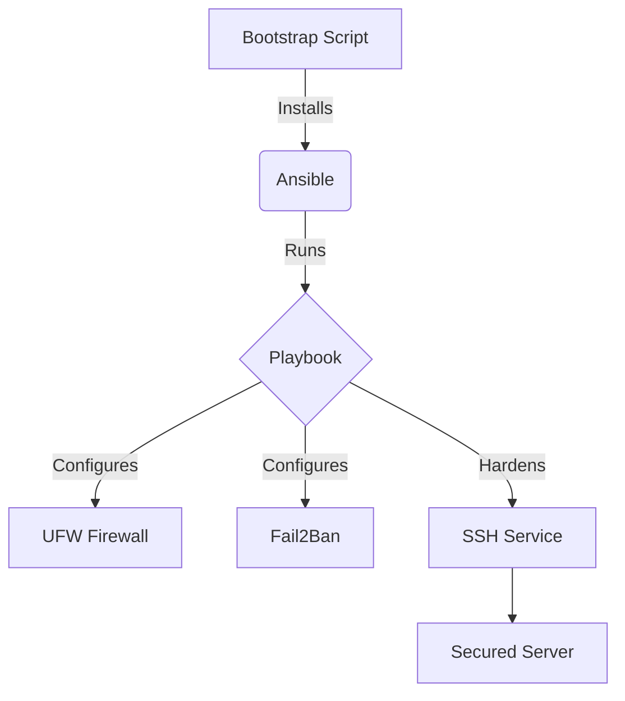

# 🔐 Project Cipher

**Automated Security Hardening Suite for Linux Systems**


## 🚀 Overview

Project Cipher is an **Infrastructure-as-Code (IaC)** solution designed to automatically harden Linux servers according to **CIS Benchmark Level 1** standards. It eliminates manual configuration drift and ensures a baseline of security for all deployed nodes.

### 🛡️ Features

- ** Firewall Automation:** Configures `UFW` to deny incoming traffic by default.
- ** Intrusion Prevention:** Installs and configures `Fail2Ban` with aggressive jail policies.
- ** SSH Hardening:** Disables root login, enforces key-based auth, and changes default ports.
- ** Idempotent:** Safe to run multiple times without breaking configuration.

## 📦 Installation & Usage

### Prerequisites
- Ubuntu/Debian Server
- Root or Sudo access

### Quick Start

```bash
git clone https://github.com/buzzdotsui/project-cipher.git
cd project-cipher
chmod +x scripts/bootstrap.sh
./scripts/bootstrap.sh
```

## 🏗️ Architecture



## 📄 Compliance

This suite addresses the following CIS Benchmarks:
- 5.2.1 Ensure SSH Protocol is set to 2
- 5.2.5 Ensure SSH MaxAuthTries is set both to 4 or less
- 3.5.1.1 Ensure UFW is installed

## 🤝 Contributing

Pull requests are welcome. For major changes, please open an issue first to discuss what you would like to change.

## 📄 License

[MIT](https://choosealicense.com/licenses/mit/)
